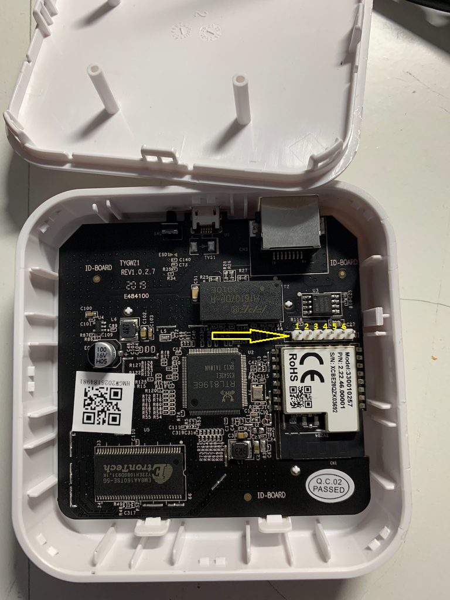
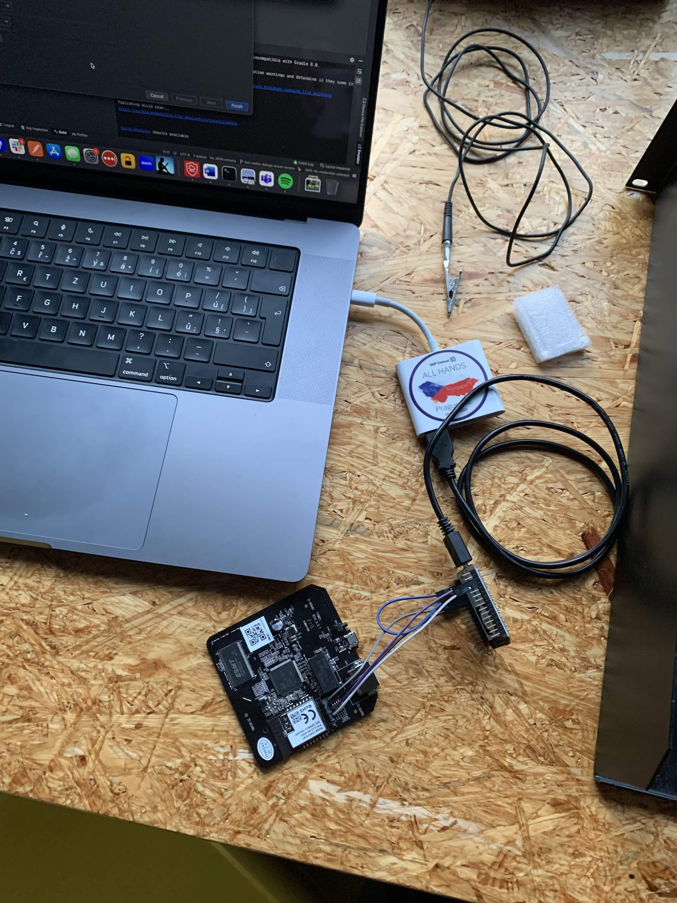

Prerequisites: 
- Lidl SGWZ 1 A1 (SGWZ 1 A2 is not yet supproted)
- NodeMcu ESP8266

- We are using NodeMcu ESP8266 as I have it handy but I do not have stand allone TTL coverter. NodeMcu ESP8266 is using 3.3v internally which is necessity for this setup.



* Pin 1 = Vcc (3.3V) (bottom pin in picture)
* Pin 2 = Ground
* Pin 3 = U2 Serial TX
* Pin 4 = U2 Serial RX
* Pin 5 = ZigBee module ARM Debug SWDIO
* Pin 6 = ZigBee module ARM Debug SWCLK

Wiring:

* NodeMCU GND -> NodeMCU EN
* NodeMCU 3V3 -> LidlZigbee 3V3
* NodeMCU GND -> LidlZigbee GND
* NodeMCU TX -> LidlZigbee TX
* NodeMCU RX -> LidlZigbee RX



Sources: 
* https://paulbanks.org/projects/lidl-zigbee/#overview
* https://community.openhab.org/t/hacking-the-lidl-silvercrest-zigbee-gateway-a-step-by-step-tutorial/129660
* https://www.elvisek.cz/2021/08/zigbee-modifikace-lidl-silvercrest-zb-gateway/
* https://www.zigbee2mqtt.io/advanced/remote-adapter/connect_to_a_remote_sonoff_zbbridge.html

## Additional commands

```bash
screen /dev/tty.usbserial-2110 38400
```
```bash
ssh -p2333 -oHostKeyAlgorithms=+ssh-dss root@192.168.1.254
```
```bash
ifconfig eth1 192.168.1.97 netmask 255.255.255.0;
```

